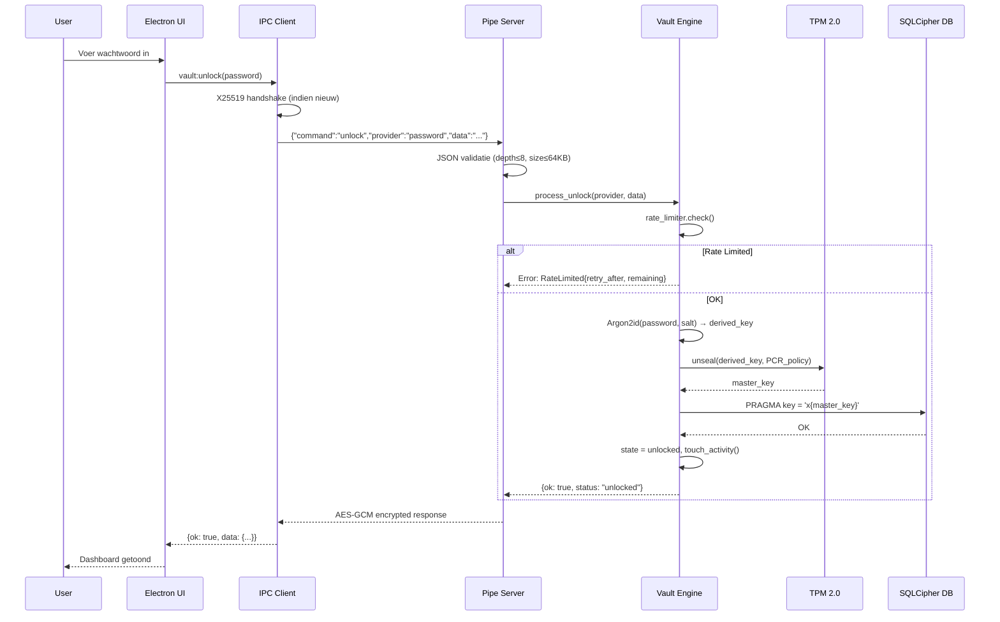

# SovereignKernel Vault — Architectuur

## Overzicht

```mermaid
graph TB
    subgraph "Windows 11 Host"
        subgraph "Electron UI (Renderer)"
            UI[React Dashboard]
            Wizard[Setup Wizard]
            Tray[System Tray]
        end

        subgraph "Electron Main Process"
            IPC[IPC Client<br/>X25519 + AES-256-GCM]
            Preload[Context Bridge]
        end

        subgraph "Windows Service (.NET 8)"
            Pipe[Named Pipe Server<br/>\\.\pipe\SovereignKernelVault]
            Integrity[Integrity Check<br/>SHA256 self-hash]
            Shutdown[Graceful Shutdown<br/>WAL + backup]
            LogRot[Log Rotation<br/>10×10MB]
            EventLog[Windows Event Log]
        end

        subgraph "Rust Core (via FFI / CLI)"
            Vault[Vault Engine]
            RateLim[Rate Limiter<br/>SQLite-backed]
            Backup[Backup Manager<br/>SHA256 manifests]
            Audit[Audit Logger<br/>Hash-chained]

            subgraph "Crypto Layer"
                AES[AES-256-GCM]
                Argon2[Argon2id KDF]
                HKDF[HKDF-SHA256]
                X25519[X25519 ECDH]
                SecDel[Secure Delete<br/>3-pass]
            end

            subgraph "TPM Layer"
                TPM[TPM 2.0 Manager]
                PCR[PCR Baseline]
                Counter[Monotonic Counter]
            end

            Shamir[Shamir SSS<br/>GF(256)]
        end

        subgraph "Hardware"
            TPMChip[TPM 2.0 Chip]
            Disk[(Encrypted Storage)]
        end
    end

    UI --> Preload
    Preload --> IPC
    IPC -->|"Length-prefixed frames<br/>AES-256-GCM encrypted"| Pipe
    Pipe --> Vault
    Vault --> RateLim
    Vault --> Audit
    Vault --> Backup
    Vault --> AES
    Vault --> Argon2
    Vault --> Shamir
    Vault --> TPM
    TPM --> TPMChip
    Vault --> Disk
    Audit --> Disk
    Pipe --> EventLog
    Integrity --> EventLog
```

## Component Verantwoordelijkheden

| Component | Crate/Project | Rol |
|-----------|--------------|-----|
| `vault-common` | Rust crate | Gedeelde error types, traits |
| `vault-crypto` | Rust crate | AES-GCM, Argon2id, HKDF, nonce management, secure delete |
| `vault-tpm` | Rust crate | TPM 2.0 interactie, PCR baseline, monotone counter |
| `vault-core` | Rust crate | Vault logica, rate limiting, backup, state validatie |
| `vault-audit` | Rust crate | Tamper-evident hash-chained audit trail |
| `vault-shamir` | Rust crate | Shamir Secret Sharing over GF(256) |
| `vault-db-tool` | Rust binary | CLI voor database management |
| `windows-service` | .NET 8 | Windows Service met named pipe server |
| `electron-ui` | TypeScript/React | Desktop UI met system tray |

## Dataflow: Unlock Sequence



## Beveiligingslagen

```
┌─────────────────────────────────────────────────────────┐
│ Layer 5: Transport Security                              │
│ • X25519 key exchange + AES-256-GCM per-session         │
│ • Length-prefixed framing, sequence numbers              │
│ • 1MB max message, 30s timeout                          │
├─────────────────────────────────────────────────────────┤
│ Layer 4: Access Control                                  │
│ • Named pipe ACL (SYSTEM + Administrators only)          │
│ • Rate limiting (5 attempts / 300s window)               │
│ • Command whitelist (7 commands)                         │
│ • Concurrent connection limit (10)                       │
├─────────────────────────────────────────────────────────┤
│ Layer 3: Key Management                                  │
│ • Argon2id derivation (65MB, 4 iter, 4 parallel)        │
│ • TPM 2.0 sealed storage + PCR policy                   │
│ • Shamir 3-of-5 recovery                                │
│ • DPAPI-wrapped HMAC keys                               │
├─────────────────────────────────────────────────────────┤
│ Layer 2: Data Protection                                 │
│ • SQLCipher (AES-256-CBC, 256000 KDF iterations)        │
│ • In-memory AES-256-GCM (SecureMemory)                  │
│ • Zeroize-on-drop for all secrets                       │
│ • Secure 3-pass file deletion                           │
├─────────────────────────────────────────────────────────┤
│ Layer 1: Integrity & Audit                               │
│ • SHA256 self-hash anti-tamper                           │
│ • Hash-chained audit log                                │
│ • State validation (constant-time compare)              │
│ • Windows Event Log integration                          │
└─────────────────────────────────────────────────────────┘
```

## Bestandsstructuur

```
sovereignkernel/
├── .github/workflows/     CI/CD pipelines
├── crates/
│   ├── vault-common/      Error types, shared traits
│   ├── vault-crypto/      Cryptographic primitives
│   │   ├── keys.rs        AES-GCM, nonce generation, constant-time ops
│   │   ├── kdf.rs         Argon2id key derivation
│   │   ├── hkdf.rs        HKDF-SHA256
│   │   ├── memory_lock.rs mlock for secret pages
│   │   └── secure_delete.rs 3-pass secure file deletion
│   ├── vault-tpm/         TPM 2.0 integration
│   ├── vault-core/        Business logic
│   │   ├── vault.rs       Main vault state machine
│   │   ├── rate_limiter.rs SQLite-backed rate limiting
│   │   ├── backup.rs      Verified backup/restore
│   │   ├── db_encryption.rs SQLCipher integration
│   │   └── state_validator.rs Constant-time state checks
│   ├── vault-audit/       Tamper-evident audit logging
│   ├── vault-shamir/      Shamir Secret Sharing (GF256)
│   └── vault-db-tool/     CLI binary
├── windows-service/       .NET 8 Windows Service
│   ├── Program.cs         Entry point + console mode
│   ├── Tpm2VaultService.cs Service lifecycle
│   ├── HardenedPipeServer.cs Secure named pipe server
│   ├── SecureMemory.cs    AES-GCM protected memory
│   ├── IntegrityCheck.cs  Self-hash verification
│   ├── GracefulShutdown.cs WAL + backup on stop
│   ├── LogRotation.cs     Rotating file logger
│   └── AuditEventLogger.cs Windows Event Log bridge
├── electron-ui/           Desktop UI
│   ├── src/main/          Electron main process
│   ├── src/renderer/      React UI components
│   └── src/shared/        Shared TypeScript types
├── scripts/               Deployment scripts
│   └── Install-SovereignKernel.ps1
└── docs/                  Documentation
```
